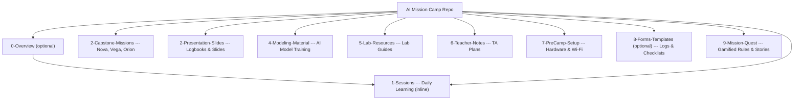

### 🚀 **2025 Data Science AI Mission Camp**

Welcome to the official curriculum and resources repo for the **2025 AI Data Science Mission Camp**. This experience brings high school students into the world of **object detection**, **sensor programming**, and **AI-powered missions**, simulating life aboard a **space deck**.

---

### 🧭 **How to Use This Repo**

1. **Start in `1-Sessions/`** – Each day’s learning content includes all background needed. No hunting for extra docs.
2. **Explore `2-Capstone-Missions/`** – Missions like Nova, Vega, and Orion include setup instructions and embedded story context right in each team folder.
3. **Use `3-Presentation-Slides/`** – Log your team progress daily and prepare your final demo with built-in templates.
4. **Train models with `4-Modeling-Material/`** – Includes labeled examples and AI techniques for student customization.
**Train models with `4-Modeling-Material/`** – Includes labeled examples and AI techniques for student customization.
6. **Need quick help?** A guided, step-by-step assistant will be available soon to walk you through building your own camp setup. 🛠️

---

Let’s get ready to launch your first **AI-powered mission**. ✨

| **Folder**                          | **Description**                                                                   |
| ----------------------------------- | --------------------------------------------------------------------------------- |
| **0-Overview/** *(optional)*        | 📖 Program overview, simulation framework, and folder map (optional if inline)    |
| **1-Sessions/**                     | 🛠️ Daily learning walkthroughs — background and activities are inlined           |
| **2-Capstone-Missions/**            | 👨‍👩‍👧‍👦 Team builds, mission briefs (Nova, Vega, Orion), all context embedded |
| **2-Presentation-Slides/**          | 🎤 Logbook templates, final demo slides, and TA kickoff decks                     |
| **4-Modeling-Material/**            | 🧠 Computer vision, Roboflow training, and advanced AI modeling                   |
| **5-Lab-Resources/**                | 📚 Class and group lab guides, materials, and instructions                        |
| **6-Teacher-Notes/**                | 🧭 TA lesson plans, teaching aids, and facilitation guides                        |
| **7-PreCamp-Setup/**                | ⚙️ Hardware, sensors, and network setup instructions                              |
| **8-Forms-Templates/** *(optional)* | 📝 Mission checklists, flight logs, debrief templates                             |
| **9-Mission-Quest/**                | 🔍 Gamified flight rules, team challenges, and storytelling extensions            |

